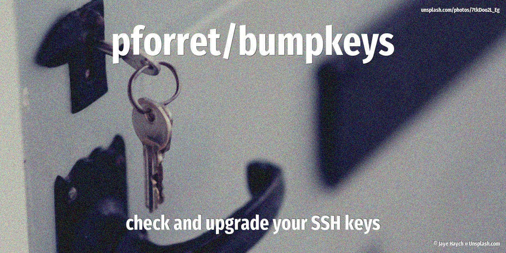

[](https://basher.gitparade.com/package/)

# bumpkeys



Upgrade your SSH keys for better security

Inspired by [Upgrade your SSH keys! (2016)](https://blog.g3rt.nl/upgrade-your-ssh-keys.html) and [Secure Secure Shell (2015)](https://stribika.github.io/2015/01/04/secure-secure-shell.html)

## Installation

with [basher](https://github.com/basherpm/basher)

	$ basher install pforret/bumpkeys

or with `git`

	$ git clone https://github.com/pforret/bumpkeys.git
	$ cd bumpkeys

## Usage

### USAGE

    Program: bumpkeys 0.1.0 by peter@forret.com
    Updated: Jan 23 14:41:35 2021
    Description: Upgrade your SSH keys for better security
    Usage: bumpkeys [-?] [-q] [-v] [-f] [-o] [-t <algorithm>] [-a <trials>] [-b <rsabits>] [-l <log_dir>] [-t <tmp_dir>] [-d <key_dir>] <action>
    Flags, options and parameters:
    -?|--help        : [flag] show usage [default: off]
    -q|--quiet       : [flag] no output [default: off]
    -v|--verbose     : [flag] output more [default: off]
    -f|--force       : [flag] do not ask for confirmation (always yes) [default: off]
    -o|--rfc4716     : [flag] use RFC4716 key format (only on recent ssh installations) [default: off]
    -t|--algorithm <?>: [option] algorithm for asymmetric keys: rsa/ed25519  [default: ed25519]
    -a|--trials <?>  : [option] number of primality tests  [default: 100]
    -b|--rsabits <?> : [option] key length for RSA key pairs  [default: 4096]
    -l|--log_dir <?> : [option] folder for log files   [default: /Users/pforret/log/bumpkeys]
    -t|--tmp_dir <?> : [option] folder for temp files  [default: .tmp]
    -d|--key_dir <?> : [option] SSH folder to check/upgrade  [default: /Users/pforret/.ssh]
    <action>         : [parameter] action to perform: analyze/create/protect
    
    ### TIPS & EXAMPLES
    * use bumpkeys check to check if this script is ready to execute and what values the options/flags are
    * use bumpkeys analyze to analyze all SSH keys in the folder
      bumpkeys analyze
    * use bumpkeys create to create new modern secure SSH key pair
      bumpkeys create
    * use bumpkeys protect to add password to existing key pairs
      bumpkeys protect
    * >>> bash script created with pforret/bashew
    * >>> for developers, also check pforret/setver

### bumpkeys analyze
```
> ./bumpkeys -d tests/test_keys analyze 
#created   | filename             | algorithm  | bits | security
2021-01-23 | id_ec_bcrypt         | ED25519    |  256 | OK
2021-01-23 | id_ecdsa_256         | ECDSA      |  256 | ⚠️ UPGRADE!
2021-01-23 | id_encrypted         | RSA        | 3072 | OK
2021-01-23 | id_rsa_1024          | RSA        | 1024 | 🛑 UPGRADE!!
2021-01-23 | id_rsa_2048          | RSA        | 2048 | ⚠️ UPGRADE!
2021-01-23 | id_rsa_sha512        | RSA        | 3072 | OK 
```

## Acknowledgements

* script created with [bashew](https://github.com/pforret/bashew)

&copy; 2021 Peter Forret
